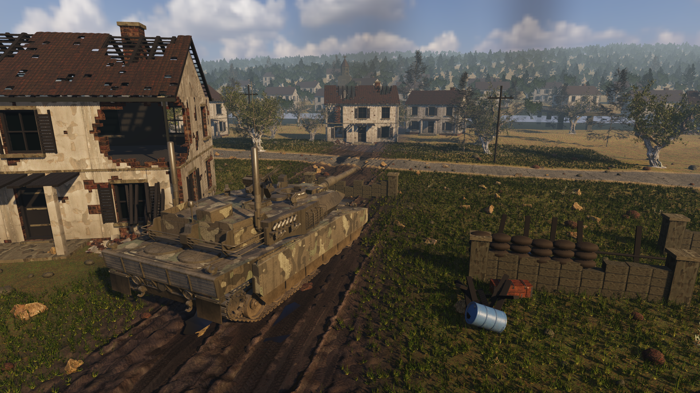

# FRONTLINE visual production — current checkpoint

Updated: 2026-09-09. **VISUAL ACCEPTANCE: FAILED / NOT READY.**

The objective remains the user-approved Golden Frame, rendered by real Godot 4.7.1 at 1920×1080. The screenshot below is work in progress and does not satisfy that objective. A successful import, a saved screenshot, asset counts and CI results do not grant visual approval.

## User scope correction, 2026-09-09

The user is evaluating the highest main-image visual quality we can actually produce. This is not a request to reproduce every object or complete a battlefield. Distant scenery is now frozen. Do not add or refine remote houses, trees, bridge details or background props. Work is limited to the foreground house, tank, nearby ground/vegetation and illumination of the complete frame. Judge the actual appearance of materials, light, ground contact and depth; object counts and implementation effort do not count as progress.

**Latest review: the user explicitly rejected the repeated lighting/exposure attempts as no meaningful progress. This round has failed to deliver the requested high-quality image. Stop the exposure/reflection trial loop; do not call this screenshot the highest achievable quality.**

This checkpoint includes corrected grass alpha masks, the foreground house variant, main-light orientation, surface changes, a bounded-radiance sky shader and 1.5× internal sampling. These are implementation changes only. The result still has simplistic building surfaces, an insufficiently convincing armored vehicle finish, uniform vegetation and weak mud/water realism. Further distant work is prohibited by the latest scope. Runtime exits with a seven-texture RID cleanup warning, retained in the log; the captured frame is not a visual PASS.

## Evidence

- [Latest real runtime capture](../../artifacts/visual_reset/river_town_actual_1920x1080.png)
- [Runtime metadata](../../artifacts/visual_reset/runtime_metrics.json): Godot 4.7.1 stable, Forward+, Intel UHD Graphics, native 1920×1080 viewport capture after `frame_post_draw`, with 1.5× internal 3D sampling. Timing is a short capture sample, not a performance acceptance test.
- [User-supplied approved reference](../visual_reference/approved_user_frame.png). SHA256 `7f2f462d34387d32109d4feb83f197f88adbc3ff0f54b26d0142172789f16e3d`. This is the user's subsequently supplied image; the older repository SHA256 refers to a different, missing binary. Neither identity is silently overwritten.
- [External asset attribution](../licenses/visual_slice/ATTRIBUTION.md) and [source/license records](../licenses/visual_slice/source_license_manifest.json).

## What is implemented locally

A separate visual-only scene now combines a licensed Abrams model, authored dimensional houses, real source foliage/rocks/props, terrain, water, sky and native Godot effects. Its launch command is `scripts/production/run_river_town_slice.ps1`. The gameplay scene, Core logic and project startup configuration are unchanged. The source is an isolated snapshot of `dev/godot-golden-scene-v1` at `e909d17ac2d521b0fcef4720499a3578024ba129`.

The status and raw evidence are published in commit `2fc6dc3287e21b12cde0a4d5e14bf303f04f80da`. The runnable scene, scripts, self-contained GLBs, textures, attribution and evidence are published in commit `85a5181adc47f690787eae41a8b061626be622eb` on `dev/visual-production-reset`. The accepted product state is not advanced, and no visual PASS is claimed.

`scripts/production/verify_visual_checkpoint.py` checks evidence dimensions, real engine identity, runtime errors and frozen-file isolation. Its result separates **integrity PASS** from **visual FAIL_NOT_READY**. It does not award a visual score.

## Why the image still fails

1. The hero house is still a procedural layout asset. Its damage, roof structure, edges and surface history are much too regular and shallow for the reference.
2. The tank is recognizable and substantially more detailed than the old proxy, but paint, metal, attached equipment, mud and ground contact do not yet have the reference's physical credibility.
3. Mud ruts and puddles remain overly regular. Water looks like dark patches; the surrounding soil and grass do not form the dense, uneven foreground in the approved frame.
4. Near vegetation and foreground assets still need a coherent, natural appearance. The existing background remains a known limitation, but the user has explicitly stopped further distant-detail work.
5. Illumination lacks the reference's warm directional highlights, cool soft shadows and coherent atmosphere. Repeated exposure changes have not solved the asset problems.

## Execution correction

The work drifted into rebuilding a pipeline and expanding the scene before the largest visible assets were convincing. Repository synchronization was also delayed. These are execution failures, not reasons to lower the goal.

Work is now restricted to one fixed frame, the foreground house, tank and nearby ground, and overall illumination. New pipeline work, broader battlefield scope and distant-detail refinement are stopped. The generated house kit is not an accepted production-quality asset; replacing it solely to reproduce the reference's object details is outside the user's immediate request. The required deliverable is the highest main-image quality actually obtained in Godot, with an honest comparison to the reference.

Every further repository checkpoint must link a real runtime image, state the remaining visible failures, and retain the exact source/license records. There is no completion percentage or promised acceptance date supported by the current evidence.
