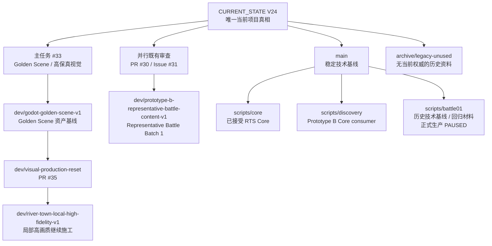

# FRONTLINE Repository Map

SNAPSHOT_DATE=2026-09-09
SNAPSHOT_MAIN=bdaa6f05557576f6709e0cadbcc48ca5ac6a31cc
SOURCE_OF_TRUTH=docs/current/CURRENT_STATE.md

这个文件解决一个问题：**打开仓库的人应该马上知道“现在在做什么、代码在哪、视觉资产在哪、哪些只是历史”。**

## 1. 当前工作图



## 2. 当前分支重量

| 分支 | 状态 | 跟踪文件体量 | 用途 |
|---|---:|---:|---|
| `main` | KEEP | ~0.55 MB | 当前稳定技术/文档基线 |
| `dev/prototype-b-representative-battle-content-v1` | KEEP | ~0.54 MB | PR #30，既有 gameplay review |
| `dev/godot-golden-scene-v1` | HOLD/KEEP | ~318 MB | Golden Scene 大型资产基线；仍被视觉链使用 |
| `dev/visual-production-reset` | KEEP | ~489 MB | PR #35 当前视觉重建链 |
| `dev/river-town-local-high-fidelity-v1` | KEEP | ~489 MB | 当前局部高保真继续施工 |
| `archive/legacy-unused` | ARCHIVE | historical | 旧治理/旧窗口历史，不是当前权威 |

> GitHub 仓库报告约 644 MB，而 `main` 当前树只有约 0.55 MB。差额主要来自历史 Git 对象和视觉施工分支中的大型 GLB/PNG/PBR 资产。删除几个文本文件不会显著缩小仓库体量；真正的体量治理要在视觉资产链稳定后做。

## 3. main 目录怎么读

```text
project.godot
│
├─ docs/current/          ← 先看这里：CURRENT_STATE + DECISION_LOG
├─ docs/design/           ← 当前 Golden Frame / 生产设计支持材料
├─ docs/ops/              ← 仓库地图、分支清理登记
├─ docs/gpt_windows/      ← 4 个 GPT 路由窗口入口
│
├─ scripts/core/          ← 已接受、可复用的 RTS Core
├─ scripts/discovery/     ← 当前发现阶段 Prototype B
├─ scripts/battle01/      ← 历史 Battle01 技术基线，生产暂停但仍有回归价值
│
├─ scenes/                ← Godot 场景
├─ resources/             ← Formation 等资源
├─ tests/                 ← Core / Prototype / Battle01 回归
├─ assets/ui/             ← main 上的小型 UI 基础资产
└─ .github/workflows/     ← 当前 main CI
```

## 4. 什么是当前权威

| 层级 | 文件/表面 |
|---|---|
| 1 | 用户明确决定 |
| 2 | `docs/current/CURRENT_STATE.md` |
| 3 | `docs/FRONTLINE_PROJECT_CHARTER_V3.md` |
| 4 | `docs/FRONTLINE_PROJECT_SYSTEM_V2.md` |
| 5 | 当前 approved design + Active Issue |
| 6 | 当前代码/runtime/CI 证据 |
| 7 | 历史分支、旧文档、旧 PASS/FROZEN |

当前协作版本：
- Project System: **V2**
- GPT Multi-Window System: **V3**
- GPT Runtime Plan: **V2**

## 5. 视觉资产注意事项

大型视觉资产现在仍在施工分支，不在 main。

当前观察到的最大单文件包括约 31 MB 的树模型、27 MB 的 Abrams GLB、24 MB 的 fir GLB，以及多份 5–10 MB PBR/建筑资源。这些不是自动判定为垃圾，因为当前 Golden Scene 正在实际使用它们。

资产清理的正确时机：
1. Golden Scene / River Town 视觉方向稳定；
2. 确认最终实际引用集合；
3. 对未引用、重复版本、失败迭代导出物做依赖扫描；
4. 再进行物理删除或 Git history 重写。

## 6. 分支清理

完整清单见：

`docs/ops/BRANCH_CLEANUP_REGISTER_20260909.md`

原则：
- 已合并 / 已 superseded 且无当前依赖：REMOVE_BRANCH。
- 有当前 PR / 当前视觉施工依赖：KEEP。
- 只有历史证据价值：ARCHIVE。
- 唯一未归档实验内容：HOLD，先别误删。
